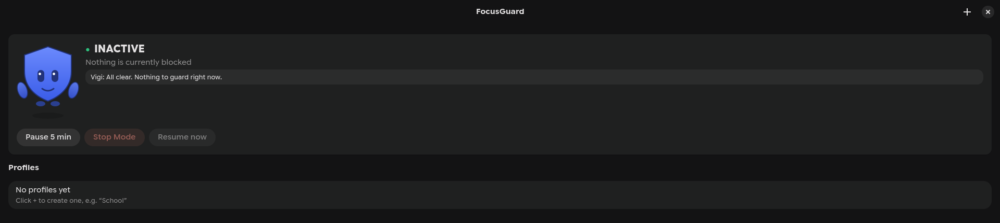
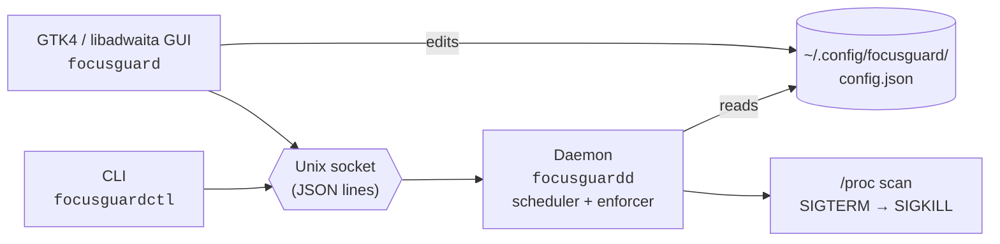

<div align="center">


# FocusGuard

**A real, enforced focus mode for Arch Linux + Hyprland — guarded by Vigi.**

Pick apps in a native GTK4 window. Schedule them, or block them on the spot.
A background daemon actually stops them from running — no root required.

[](LICENSE)
[](pyproject.toml)
[](#)
[](#)
[](https://github.com/rusty-workshop/focusguard/actions/workflows/tests.yml)

🌐 **[Live site](https://focusguard.rusty.is-a.dev/)**

</div>

<br>

<div align="center">
  
</div>

<br>

FocusGuard exists because "focus mode" apps on Linux are almost always
either a honor-system timer, or built for GNOME, or built for a session
manager you're not running. This one does the un-glamorous thing that
actually works: it watches your process table and kills what you told it
to, on a schedule or on demand, until *you* explicitly say stop. It just
happens to have a small blinking shield friend doing the telling.

## Contents

- [Meet Vigi](#meet-vigi)
- [Features](#features)
- [Why not an existing tool?](#why-not-an-existing-tool)
- [Architecture](#architecture)
- [How enforcement actually works](#how-enforcement-actually-works)
- [Known limitations](#known-limitations)
- [Website blocking](#website-blocking)
- [Installing](#installing-arch-linux)
- [Uninstalling](#uninstalling)
- [Configuration](#configuration)
- [CLI](#cli)
- [Hyprland keybind](#hyprland-keybind-optional-not-installed-automatically)
- [Notifications](#notifications)
- [Logging](#logging)
- [Security notes](#security-notes)
- [Development / tests](#development--tests)

## Meet Vigi

<table>
<tr>
<td width="140" align="center" valign="top">
  
</td>
<td valign="top">

**Vigi** is FocusGuard's mascot — a small shield who blinks, glances
around, waves, twinkles, and shows up whenever the daemon actually stops
something you told it to. Not a nag, not a lecture — just a quick,
friendly redirect.

**On this page**, Vigi is doing all of this at once, on loop: an idle
bob-and-tilt, a squash-and-stretch shadow, a soft radar-style "on guard"
pulse ring, a shared eye-glance with independently timed blinks (so
there's an occasional solo wink), a periodic arm wave, and three ambient
sparkles drifting in and out on their own schedule. All pure CSS/SMIL, no
JavaScript — see [`docs/vigi.svg`](docs/vigi.svg).

Vigi also appears in two places in the app itself:

- **The main window**, floating (bob + sway + tilt, driven by GTK's own
  frame clock via `Gtk.Widget`'s CSS `transform`) next to a speech bubble
  that reflects the current state (`I'm on watch — stay on track!` /
  `Taking a short breather. Back soon.` / `All clear. Nothing to guard
  right now.`) — plus idle chatter after the window's been open a while,
  a little bounce whenever the block state changes, and a playful spin
  (with a reaction line) if you click Vigi directly.
- **Desktop notifications**, the moment a blocked app gets caught and
  stopped — one of two dozen gentle nudges (`Not right now — Discord
  can wait. You've got this.`), each shown with Vigi's own icon, throttled
  per app so retrying doesn't spam you.

Vigi never gates enforcement — the kill always happens; everything above
is a courtesy layered on top. See
[`common/mascot.py`](src/focusguard/common/mascot.py) for every message
bank and [`docs/vigi.svg`](docs/vigi.svg) for the animated source art.

</td>
</tr>
</table>

## Features

- 🖥️ **Native GTK4 + libadwaita GUI** — not a web page in a window
- 🔍 **Real app discovery** via `Gio.DesktopAppInfo`, with icons, search,
  Select All / Clear All
- 🌐 **Website blocking, in every browser** — per-profile domain list
  (`reddit.com`, `youtube.com`, …), enforced at the `/etc/hosts` level so it
  works in Vivaldi, Firefox, Chrome, or anything else, with no per-browser
  extension to install
- 📅 **Schedules** — days of week, start/end time, correctly handles
  windows that cross midnight (bedtime profiles)
- ⚡ **Manual sessions** — "start School now for 45 minutes" from the GUI
  or CLI, no schedule required
- 🧩 **Multiple profiles** — School, Study, Gaming, Bedtime, whatever —
  each with its own apps, schedule, and duration; several can be active
  at once
- ⏸️ **Explicit, visible override** — Pause 5 min / Stop Mode / Resume,
  never a silent bypass
- 🔔 **Desktop notifications** on block start/end (optional, degrades
  gracefully without `libnotify`)
- ⌨️ **Hyprland keybind ready** via a scriptable CLI — you choose the key,
  FocusGuard never touches your Hyprland config
- 🔒 **Almost no root** — app blocking runs entirely as your user; the
  *only* privileged piece is one small, narrowly-scoped script that
  maintains FocusGuard's block of `/etc/hosts` for website blocking (see
  [Website blocking](#website-blocking))

## Why not an existing tool?

| Tool | Why it doesn't fit |
|---|---|
| **Timekpr-nExT** | Manages *session* time budgets (login/logout enforcement) — no concept of blocking individual apps while you're logged in. |
| **Malcontent** (GNOME parental controls) | Built around Flatpak's permission store, accountsservice, and polkit, aimed at a GNOME session — a poor fit for a minimal Hyprland setup with no GNOME session services. |
| **cgroups alone** | Can throttle or freeze a process group but can't stop a new process from being *exec'd* without root + a BPF LSM/seccomp filter — conflicts with "no root, no risky system changes." |

So FocusGuard implements the same technique this class of tool has always
used on Linux without root: a fast poll-and-kill loop over `/proc` for your
own processes, matched against exact executable signatures resolved from
each app's `.desktop` file via `Gio.DesktopAppInfo`.

## Architecture



- The **GUI** never kills anything itself. It only edits `config.json` and
  sends commands to the daemon over a Unix socket.
- The **daemon** is the only thing that touches processes. It runs as a
  `systemd --user` service and works with no GUI open.
- **`focusguardctl`** is a thin CLI over the same socket — bind it to a
  Hyprland keybind, or script it.

## How enforcement actually works

Every `poll_interval_seconds` (default **1s**), the daemon:

1. Recomputes which apps should currently be blocked — the union of every
   profile whose schedule is active or that was started manually, minus
   anything paused.
2. Scans `/proc` for your own processes and compares each one's `comm`,
   resolved executable path, and (for Flatpak) its app-id argv token
   against the blocked apps' *exact* signatures — **never** a substring
   match.
3. Sends `SIGTERM`; if the process is still alive after
   `grace_period_seconds` (default **3s**), escalates to `SIGKILL`.

Because this runs on every tick, a relaunch attempt is caught again on the
next scan. A brief flash before the process dies is expected — this is how
this entire class of Linux app-blocker works without root.

A small fixed safety list (`focusguard.common.procs.PROTECTED_COMM`) is
subtracted from *every* block, regardless of what you configure: Hyprland,
systemd, D-Bus, PipeWire/WirePlumber, NetworkManager, and FocusGuard's own
processes can never be signaled.

### Known limitations

> [!NOTE]
> These are inherent to root-free process blocking on Linux, not bugs.

- **Steam games** — selecting "Steam" blocks the Steam client itself, not
  each game binary it launches (those run as separate processes under a
  different name). Killing Steam does not reliably kill an already-running
  game.
- **AppImages** — some mount themselves at a temp path that changes
  between runs, which can defeat basename/path matching. Most that install
  to a stable path work fine.
- **Very fast relaunchers** — a script that respawns faster than the poll
  interval could theoretically win a race for a fraction of a second on
  each cycle. Lower `poll_interval_seconds` if this matters to you.
- **Electron/Chromium apps** (Discord, Vivaldi, etc.) spawn several
  processes, but they all share the same real executable, so matching one
  signature correctly catches all of them — this one isn't actually a
  limitation, just worth knowing.

## Website blocking

Blocked apps and blocked websites are both per-profile, and both enforced
by the same daemon, but the *mechanism* is different: apps are stopped by
killing processes, websites can't be — there's no process to kill until
after DNS has already resolved. So website blocking works one level down,
at the OS's own hostname resolution:

1. Each profile has its own `blocked_domains` list (e.g. `reddit.com`),
   editable from the profile editor right next to the app picker.
2. Whenever the currently-active domain set changes, the daemon hands it to
   a tiny, dedicated root-run script
   ([`packaging/focusguard-hosts-helper`](packaging/focusguard-hosts-helper))
   via `sudo -n` (never interactive — if sudo would prompt for a password,
   it fails fast instead of hanging).
3. That script re-validates every domain against a strict allow-pattern
   (rejecting anything that isn't a plausible hostname) and rewrites *only*
   the block of `/etc/hosts` between two `# FocusGuard managed block`
   markers, redirecting the domain and its `www.` variant to `0.0.0.0`
   (instant connection refused, not a hang). Everything else in the file —
   your own entries, other tools' entries — is left alone.

Because this happens at the hosts-file level, it blocks the domain for
**every browser and every app on the system** the moment it resolves the
name — Vivaldi, Firefox, a Chromium build, `curl`, all of them — with no
per-browser extension to install or keep updated. The block is torn down
automatically the moment a profile becomes inactive, and it's cleared
entirely when the daemon stops.

### One-time setup: passwordless sudo for the helper

This is the one place FocusGuard needs anything beyond your own user
account. The PKGBUILD installs a sudoers drop-in
([`packaging/focusguard-sudoers`](packaging/focusguard-sudoers)) granting
**only** members of the `wheel` group passwordless `sudo` to run **only**
that one script at its exact installed path — nothing else is granted, and
the script itself re-validates its input as if it were untrusted, since
(via sudo) it effectively is. If you're not in `wheel`, either add yourself
(`sudo usermod -aG wheel $USER`, then log out/in) or edit the drop-in to
name your user directly — the file has a comment showing the one-line
change.

`focusguardctl doctor` checks that this is set up correctly and tells you
exactly what's missing if not. Website blocking degrades gracefully if it
isn't: app blocking keeps working, and the daemon logs (and shows one
desktop notification for) the failure rather than retrying silently
forever.

## Installing (Arch Linux)

### Dependencies

```bash
sudo pacman -S python python-gobject gtk4 libadwaita
```

`libnotify` (for `notify-send`) and a running `systemd --user` instance are
recommended but optional — see [Notifications](#notifications).

### Option A: PKGBUILD (recommended)

```bash
git clone https://github.com/rusty-workshop/focusguard.git
cd focusguard
makepkg -si
```

This installs `focusguard`, `focusguardd`, `focusguardctl`, the systemd
user unit, the desktop entry, and the icon under `/usr`.

### Option B: pip (user install)

```bash
git clone https://github.com/rusty-workshop/focusguard.git
cd focusguard
pip install --user .
```

If you use `pip install --user .`, edit
[`packaging/focusguard.service`](packaging/focusguard.service)'s
`ExecStart=` to the absolute path printed by `which focusguardd` before
installing the service — a bare command name in a systemd unit is only
resolved from the system path (`/usr/bin` etc.), not `~/.local/bin`.

Then install the systemd unit and desktop file yourself:

```bash
mkdir -p ~/.config/systemd/user ~/.local/share/applications ~/.local/share/icons/hicolor/scalable/apps
cp packaging/focusguard.service ~/.config/systemd/user/
cp packaging/focusguard.desktop ~/.local/share/applications/
cp packaging/focusguard.svg ~/.local/share/icons/hicolor/scalable/apps/
```

### Enable the daemon

```bash
systemctl --user daemon-reload
systemctl --user enable --now focusguard.service
```

Check it's running:

```bash
systemctl --user status focusguard.service
focusguardctl status
```

Launch the GUI from your app launcher ("FocusGuard") or:

```bash
focusguard
```

## Uninstalling

```bash
systemctl --user disable --now focusguard.service
```

| Install method | Remove the package |
|---|---|
| PKGBUILD | `sudo pacman -R focusguard` |
| pip | `pip uninstall focusguard`, then delete the files you copied manually (`~/.config/systemd/user/focusguard.service`, `~/.local/share/applications/focusguard.desktop`, `~/.local/share/icons/hicolor/scalable/apps/focusguard.svg`) |

**Either way**, your configuration and history are not touched
automatically — remove them yourself for a clean slate:

```bash
rm -rf ~/.config/focusguard
```

Stopping the daemon (`systemctl --user disable --now focusguard.service`)
already clears any active website block from `/etc/hosts` automatically. To
fully remove the sudo rule that enabled it: `sudo rm /etc/sudoers.d/focusguard`
(the PKGBUILD does this for you on `pacman -R`).

## Configuration

Config lives at `~/.config/focusguard/config.json` (human-readable JSON,
written atomically — a crash mid-save can never corrupt it). You normally
edit it through the GUI, but the format is simple enough to hand-edit:

```json
{
  "profiles": {
    "School": {
      "name": "School",
      "blocked_apps": ["discord.desktop", "steam.desktop", "spotify.desktop", "vivaldi-stable.desktop"],
      "blocked_domains": ["reddit.com", "youtube.com"],
      "schedule": { "enabled": true, "days": [0, 1, 2, 3, 4], "start": "08:00", "end": "15:00" },
      "manual_duration_minutes": 45
    }
  },
  "settings": {
    "poll_interval_seconds": 1.0,
    "grace_period_seconds": 3.0,
    "notifications_enabled": true
  }
}
```

| Field | Meaning |
|---|---|
| `blocked_apps` | `.desktop` file IDs (as shown by the picker) — the same ID `gio launch <id>` or `gtk-launch <id>` would use |
| `blocked_domains` | Bare domains (no `https://`, no path) — see [Website blocking](#website-blocking). `www.<domain>` is always redirected too, no need to list it separately |
| `schedule.days` | `0`=Monday … `6`=Sunday |
| `schedule.start` / `end` | `HH:MM`, 24h. A window that crosses midnight (e.g. `22:00` → `06:00` for a "Bedtime" profile) works correctly |
| `manual_duration_minutes` | How long a *manual* ("start now") activation of that profile lasts; doesn't affect the scheduled window |

If the file is malformed, the daemon logs an error and keeps running with
whatever config it last loaded successfully — it will **never** overwrite
or delete a bad file for you. Fix it and run `focusguardctl reload`.

## CLI

```
focusguardctl status              # what's blocked right now, per-profile state
focusguardctl start <profile>     # manually start a profile now (uses its manual_duration_minutes)
focusguardctl stop [profile]      # stop the active block (all profiles, or just one)
focusguardctl pause <minutes>     # suspend all enforcement for N minutes, then auto-resume
focusguardctl resume              # cancel an active pause immediately
focusguardctl toggle <profile>    # start if inactive, stop if active — ideal for a keybind
focusguardctl reload              # force-reload config.json from disk
focusguardctl doctor              # check daemon/socket/systemd/config health, exits 1 if anything's wrong
focusguardctl vigi                # say hi to Vigi (a little blink+bob animation in an interactive terminal)
```

Add `--json` *after* any command (e.g. `focusguardctl status --json`) for
machine-readable output. Exit code is `0` on success and `1` on error
either way, so it's safe to use in shell conditionals without `--json` too.

### Shell completions

Bash, zsh, and fish completions for `focusguardctl` live in
[`packaging/completions/`](packaging/completions/) — subcommands and
`--json`, plus your actual configured profile names (via `jq`, if
installed) for `start`/`stop`/`toggle`. The PKGBUILD installs all three
automatically. For a manual/pip install:

```bash
# bash (this session only)
source packaging/completions/focusguardctl.bash
# fish (persists — fish auto-loads anything in this directory)
cp packaging/completions/focusguardctl.fish ~/.config/fish/completions/
# zsh (add packaging/completions to $fpath before compinit, or copy directly)
cp packaging/completions/_focusguardctl ~/.zsh/completions/  # then `fpath+=~/.zsh/completions` in .zshrc
```

Verified live against real profiles for bash and fish; the zsh script
follows the same structure but wasn't runnable in the environment this
was built in (no zsh installed) — flagging that rather than claiming it
was tested.

## Hyprland keybind (optional, not installed automatically)

FocusGuard never edits your Hyprland config. Add a line like this yourself,
using whichever key combo is free on your setup — check your existing
binds first, since e.g. `SUPER+SHIFT+S` is a common screenshot bind and
likely already taken:

```
bind = SUPER SHIFT, F, exec, focusguardctl toggle School
```

If your Hyprland config is Lua-based:

```lua
hl.bind("SUPER + SHIFT + F", hl.dsp.exec_cmd("focusguardctl toggle School"),
    { description = "FocusGuard: Toggle School mode" })
```

### Optional status bar indicator

**Quickshell**: [`packaging/quickshell/FocusGuardIndicator.qml`](packaging/quickshell/FocusGuardIndicator.qml)
is a small, self-contained bar widget with a tiny pixel-art Vigi (built
entirely from `Rectangle`s, no image asset) next to a colored status dot +
blocked-app count. It polls `focusguardctl status --json` directly over a
plain `Quickshell.Io.Process`, so it has no dependency on any particular
shell config (illogical-impulse, waffle, or your own from scratch all
work) — just drop the file next to your other bar widgets and add
`FocusGuardIndicator {}` inside your bar's `RowLayout`.

Pixel Vigi reacts to what's actually happening on screen — independent of
whether FocusGuard is blocking anything:

- Grooves faster when music is playing (any MPRIS player)
- Flashes amber and shakes when a "distracting" app (`distractingApps`,
  editable) is the focused window
- Turns pink and blinks faster when system load is high
  (`cpuStressThreshold`)
- Falls asleep (eyes shut, motion stops) after the screen's been idle a
  while (`idleTimeoutSeconds`) — any input wakes her
- Left-click to pet her (a wiggle + a notification reaction); right-click
  still pauses 5 min / resumes; hover for a tooltip with per-profile
  detail plus whichever mood is currently active

Verified against real conditions — a real daemon (inactive and
actively-blocking states), real `/proc/loadavg` output, and the real
focused-window/MPRIS state — using a `visible: false` test window plus a
timer that logs and quits, so none of it required popping a visible
window onto the desktop to check.

**Waybar**: `focusguardctl status --json` prints machine-readable state,
so a Waybar `custom` module can poll it:

```jsonc
"custom/focusguard": {
  "exec": "focusguardctl status --json | jq -r '.blocked_apps | length | if . > 0 then \"🔒 \" + tostring else \"\" end'",
  "interval": 5
}
```

## Notifications

The daemon sends a desktop notification (via `notify-send`) when a block
starts or ends. If `notify-send`/`libnotify` isn't installed, notifications
are silently skipped — this never affects enforcement.

## Logging

Under systemd, view logs with:

```bash
journalctl --user -u focusguard -f
```

Set `FOCUSGUARD_LOG_LEVEL=DEBUG` in the service's environment for more
detail.

## Security notes

- Runs entirely as your own user — no root, no setuid, no polkit rules.
- The control socket lives under `$XDG_RUNTIME_DIR/focusguard/` (`0700`
  directory, `0600` socket) and every connection's peer UID is checked
  before any command is parsed.
- The IPC protocol is a fixed whitelist of commands with validated
  arguments — there is no way to run an arbitrary command through it, and
  nothing in the codebase spawns a shell or interpolates config/IPC data
  into a command line.
- The daemon will never signal a process owned by another UID, and a fixed
  list of session-critical process names (compositor, systemd, D-Bus,
  audio stack, and FocusGuard's own processes) can never be blocked no
  matter what you configure.
- `config.json` and `state.json` are written atomically (temp file +
  `rename`) and created with `0600` permissions.
- The one privileged operation, website blocking, is scoped as tightly as
  sudo allows: the drop-in grants `NOPASSWD` for one exact script path only
  (`/usr/lib/focusguard/hosts-helper`), never a wildcard and never `ALL`.
  That script re-validates every domain against a strict hostname pattern
  before touching disk, only ever rewrites the block of `/etc/hosts`
  between its own markers, refuses to proceed if it finds the markers in an
  inconsistent state (rather than guessing), and writes atomically (temp
  file + `rename`). `sudo -n` means a missing/misconfigured rule fails
  immediately instead of hanging the daemon on a password prompt.

## Development / tests

```bash
python -m venv .venv --system-site-packages   # need system PyGObject/GTK4
.venv/bin/pip install -e . pytest
.venv/bin/python -m pytest
```

`--system-site-packages` is required because PyGObject/GTK bindings are
installed as system packages on Arch, not via pip.

Every push and PR runs the same suite in CI
([`.github/workflows/tests.yml`](.github/workflows/tests.yml), Ubuntu +
apt's GTK4/libadwaita packages) — see the badge at the top of this file.

<br>

<div align="center">

Licensed under [AGPL-3.0-or-later](LICENSE).

</div>
